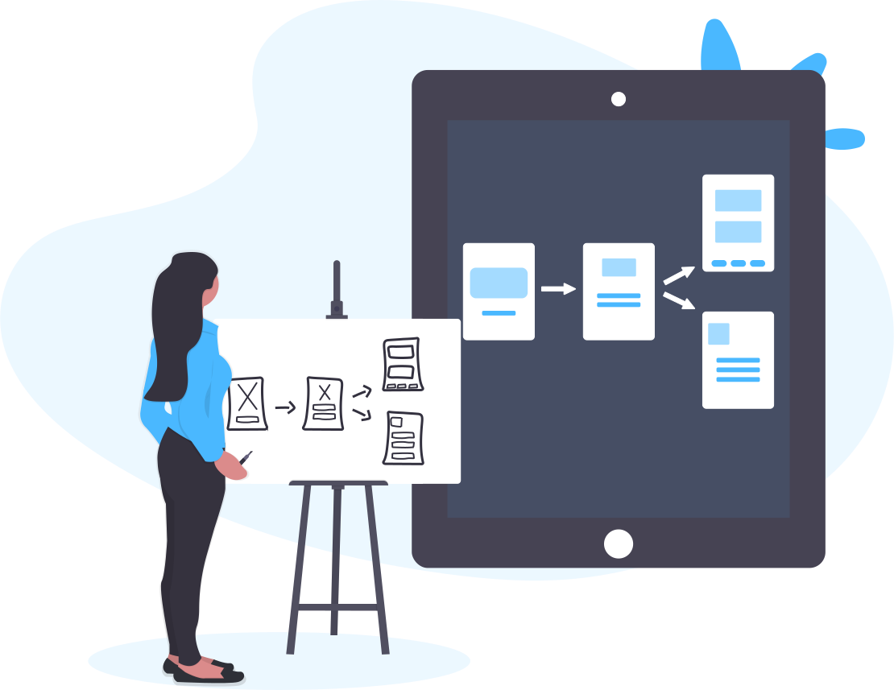
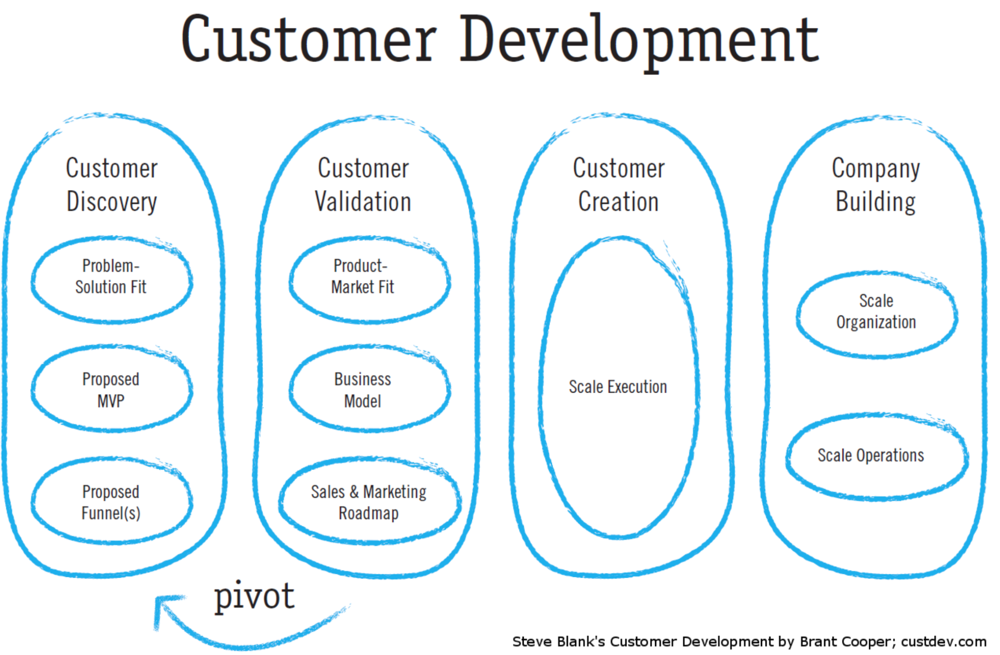

# Customer Development

  

## What is customer development?
Customer development is the practice of establishing a continuous and iterative communication line with your customer, so that you can come up with ideas, hypothesis, try them out, get feedback and adapt your product accordingly. [1]

Customer Development is a four-step framework developed by serial entrepreneur and business school Professor Steve Blank for discovering and validating the right market for your idea, building the right product features that solve customers’ needs, testing the correct model and tactics for acquiring and converting customers, and deploying the right organization and resources to scale the business. [2]

At a high level, Customer Development is about questioning your core business assumptions.  In other words, Customer Development teaches that rather than assume your beliefs about your business to be true, you should apply an engineering, or scientific method, to what is really not a scientific endeavor (building a business), in order to validate the ideas. [2]

The process resembles the scientific method:
  * Observing and describing a phenomenon.
  * Formulating a causal hypothesis to explain the phenomenon.
  * Using a hypothesis to predict the results of new observations.
  * Measuring prediction performance based on experimental tests.

Customer Development is all about understanding your customer — their problems and their needs. This understanding will allow you to create a solution that they care about. [3]

> Customer development lets you save money and time while deciding the market need. [3]

## Four stages of Customer Development

  
  

When building a business, the process is used to discover, test and validate the following your business assumptions:
  * A specific product solves a known problem for an identifiable group of users (Customer Discovery)
  * The market is scaleable and large enough that a viable business might be built (Customer Validation)
  * The business is scalable through a repeatable sales and marketing roadmap (Company Creation)
  * Company departments and operational processes are created to support scale (Company Building) [2]

## Identify the problem

Product ideas can come from different areas within the company, competitors and customers. However, one thing is certain: they need to solve a real problem or painpoint.

### Customer Discovery

Customer discovery is applying scientific method to business, is the most lean and efficient method to get user needs. During this process we will generate measurable data to confirm or deny your hypothesis.

Steps:
  1. State problem hypothesis.
  2. Test the problem hypothesis
  3. Test solution
  4. Verify you hypothesis or pivot

Once you identify that you can solve a problem to your users and they are willing to pay, you can move to the Customer Validation phase.

The ultimate goal of customer discovery is to figure out:
  - Who are your customers?
  - What problems they have?
  - Why they would buy?

### Create a problem hypothesis

Problem Hypothesis is the starting point of customer development. To create a problem hypothesis you should define:
  - Who are your users.
  - What are their needs, goals and desires.

**The Problem Hypothesis template**

As a [user type] I want [behavior] so that [outcome or benefit].

Once you have formulated a correct hypothesis, conduct User Research to validate user needs and goals.

## User research

Avoid guessing at what a user needs and look for data to confirm you assumptions. Talking to your users is key to a successful customer discovery.

There are two types; Primary and Secondary Research. Primary Research is when you directly talk with your customers to validate your hypothesis and look for opportunities. Secondary Research is when you make use of existing and available research from the industry.

### Defining your target audience

It’s important to get early feedback from your target users and their problems. To do so, you should filter your audience using a process called Screener to determine whether someone would be a good candidate for user feedback or not.

A good approach is to start with demographics first, then find patterns on their responses during user research that represents attitudes, aspirations and psychological profile (i.e., people whi believe in global warming). This way of segmentation is called Psychographics.

The bottom line is, the more specific your are when approaching your audience, the better.

### Secondary Research

As a Product Manager always start from here, using data that already exists:
  - Academic research
  - Private research firms
  - Consumer reports
  - Expert interviews

Expert interviews will help you avoid common pitfalls and refine your problem hypothesis and target audience. 
  
### Primary Research

Now it's time to get direct feedback from users. Identify good channels early so you later develop them as needed.

#### Surveys

Before you create a survey you should ask yourself what questions do you want answer with it and figure out whatever or not the survey is the right tool or not.

  What they're good for:
    - Measure attitudes, intent, or task success
    - Quantify user problems
    - Track changes over time

  What they're not good for:
    - Discover reasons behind needs
    - Learn if your product can be used effectively
    - Understand user behaviour

  They should be:
    - Short (less than 5 minutes)
    - Specific
    - Questions grouped together
    - Broad questions before specific
    - Quantitative

#### User Interviews
Interviews are the most flexible and accurate tool to understand your user's needs and goals.

  They are:
    - Open-ended questions
    - Allow the user speak freely
    - Watch the user language
    - Tailor the conversation
    - Dive more deeply with questions.

**Create a template**
1. Learning objective: What are you trying to learn?
2. Introduction: There are no right answers. Build rapport.
3. Questions: Start easy, open-ended, ask follow up questions and ask for personal contact info. Always seek clarity, i.e., "That's interesting, please, tell me more".

The *intensity arc*: Begin with easy questions, place the hardest questions in the middle and end up with follow-up questions and personal contact info.

**Prepare for interviews**
1. Get into research mode -> Friendly, engaging and casual
2. Take notes or record the session if possible
3. Stay positive and avoid bias
4. Listen to all user feedback without judgment
5. Pay attention to body language: do not intimidate nor go too fast
6. Make eye-contact
7. Express gratitude for their time
8. Encourage them when they are having hard time answering 

> Avoid conclusions before the interview ends!

**Analyze data**
After a while, patterns begin to emerge; same problems mentioned, users actively seeking potential solutions, unhappy users with the current solution and users with available budget to solve the problem.

### Good questions, bad questions

1. Ask open-ended questions
2. Don’t ask binary questions
3. Don’t ask hypothetical questions
4. Don’t ask leading questions
5. Don’t ask questions that might make them lie
6. Extra, always say: Thats interesting, tell me more

### Four types of Interviews
1. Exploratory Interview
Open questions, look for pain points, are they up for pay for a solution?
2. Validation Interview
You have a theory and you want to test it out, approve or disapprove.
3. Satisfaction oriented interview
What users think about your product. What should we stop doing? What I can do better for you?
4. Efficiency Interview
Who uses your product? What they do with it? In what circumstances. How easy is to use feature X?

### Resources
1. [Become a Product Manager | Learn the Skills & Get the Job | Udemy](https://www.udemy.com/become-a-product-manager-learn-the-skills-get-a-job/)
2. [What is Customer Development? – Market By Numbers](http://www.market-by-numbers.com/customer-development/)
3. [Customer Development for Product Managers | LinkedIn Learning, formerly Lynda.com](https://www.linkedin.com/learning/customer-development-for-product-managers)