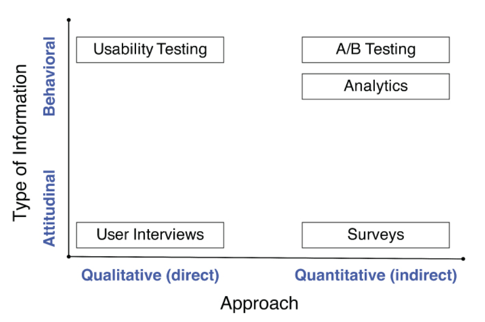
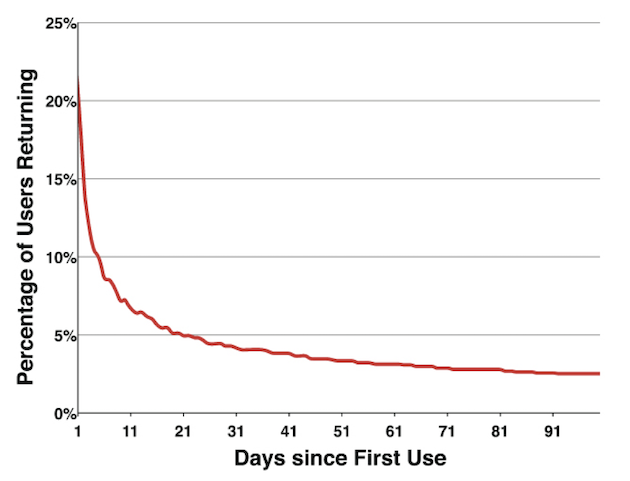

There is a close relationship between building a great product and measuring the success of the product. That is why is a hotly debated topic.

After product launch, the learning opportunities grow. User research techniques expand from initial qualitative methods only, to adding quantitative methods as well. As a Product Manager with an existing customer base now, you can start using analytics to model and measure your product.

Most companies struggle to define their key metrics. They have a massive amount of data with no methods for turning that data into insights.

Determine which metrics and measurements are right for your product is challenging. They will guide your team's efforts so you should choose them wisely.

Product Managers need to establish the expected outcome first. Then, set the actionable, measurable and time-bound metrics that measure that outcome.

{::options parse_block_html="true" /}
<div class="table-of-content">
### On this section
- [The Research Methods Framework](#the-research-methods-framework)
- [The Metric That Matters the Most (MTMM)](#the-metric-that-matters-most-mtmm)
	- [Retention Rate](#retention-rate)
- [The Lean Process Analytics](#the-lean-process-analytics)
- [Actionable Metrics](#actionable-metrics)
</div>

## The Research Methods Framework

There is a way to visualize the different types of user research methods. That is the Research Methods Framework, created by Christian Rohrer.

There are four quadrants. Attitudinal and behavioral information in one axis, and qualitative and quantitative information in the other.


<span>[From Dan Olsen's book. Resources section](#resources)</span>

Attitudinal information is what customers say they do. User interviews and surveys fall into this category. Behavioral information is what customers actually do. Usability testing, Analytics, and A/B Testing fall into this category.

Quantitative research tells you how many customers are doing (or not doing) something. Qualitative research tells you why customers do what they do (or don't do).

Both are necessary and important. They complement each other. The key is to understand when to lean more on one method than the other. When you are validating Product/Market Fit for a product, your focus should be on qualitative research. After launch, you can start expanding with quantitative methods.

> If you can’t measure it, you can’t improve it – Peter Drucker

## The Metric That Matters Most (MTMM)

The metric that matters most (MTMM), is the metric with the highest return of investment opportunity at a given time. This means that your MTMM is going to change depending on which stage your product is.

This metric changes over time because of the law of diminishing returns. At the very beginning, you will tackle the ideas that make significant progress in your metric.  After a while, remaining ideas won't make such a difference. At this point, switch to another metric that offers a higher return of investment makes more sense.

For new products, the most important thing is to know if customers really want your product. The best way to know this is with Retention metric. If your product is valuable, customers will use it regularly. Retention is the best way to measure Product/Market Fit.

There is a natural order for optimizing metrics. New products start out with retention, then move to conversion rates, and finally to acquisition.

After Product/Market Fit, you know that customers stay when they know about your product. Now, your focus should be on increasing the conversion rate. Once retention and conversion rate are optimized, exploring new and different acquisition channels will have a higher return of investment.

### Retention Rate

This metric measures the percentage of customers that use your product. It's calculated by:

```Active customers / Total customers```

The catch with retention rate is that you can't use calendar dates as most metrics do. Different customers start using the product on different dates so you need to aggregate data using relative dates.

A good way to visualize retention rates over time is by using retention curves. They start at 100 percent and then decreases day after day as your customer base returns to your product.


<span>[From Dan Olsen's book. Resources section.](#resources)</span>

There are three main parameters for retention curves:
- The initial drop-off rate
- The decrease rate of the curve
- The terminal value

These params are direct measures of Product/Market Fit. The terminal value is the most important of all. This is the value you want to improve over time.

Retention curves offer a hard way to measure Product/Market Fit. By comparing multiple retention curves over time, you can see how it has improved over time. The higher any of these parameters, the stronger your Product/Market Fit is.

## Actionable Metrics

What you measure is what you end up optimizing for. This is why is so important to choose the right metric to improve.

A common mistake among companies is using vanity metrics. That is, metrics that feel good and can be easily manipulated but tells nothing important about your product. 

As a Product Manager, you should focus your efforts on actionable metrics instead. They are directly linked to customer behavior and close to revenue or costs. These metrics tell what you should know about your product.

For each vanity metric, there is a corresponding actionable metric. A classic example of this is *trial customer* versus *converting customers* metrics. Track only the metrics that help you optimize your product for success and drop the rest.

---

This is a first draft and a just a glance of what Metrics are. Take the time to learn from the resources below. We keep them up to date!

Do you have any feedback? Please, let us know [here](https://forms.gle/8VSU94ehuD1EBGG46).

## Resources

||["The Product Book" by Product School](https://www.productschool.com/the-product-book/)
||["The Growth Handbook" by Intercom](https://www.intercom.com/books/growth-handbook)
||["The Lean Product Playbook" by Dan Olsen, Chapters 13-14](https://www.amazon.com/Lean-Product-Playbook-Innovate-Products/dp/1118960874/)|
||["What is a Vanity Metric?" by CrazyEgg](https://www.crazyegg.com/blog/glossary/what-is-a-vanity-metric/)|5 min read|