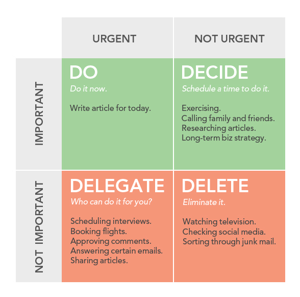

*Mental models* are frameworks for thinking. Depending on the context, mental models take different forms. A common analogy is that they are like *tools* in a toolbox.

Mental models help Product Managers to learn how systems work and to make better decisions.

A system is a set of components working together as whole. Mental models help to optimize a system by highlighting the core components and how they work together. Almost anything in the world can be described as a system.

A mental model is a representation of how something works. Making good decisions without needing to know every detail is a common scenario. A mental model simplify complex things by cutting through the noise.

There are a few mental models that are relevant to the key aspects of Product Management.

{::options parse_block_html="true" /}

### On this section
- [Eisenhower Decision Matrix](#eisenhower-decision-matrix)
- [Local/Global](#local-global)
- [The-inversion-principle](#the-inversion-principle)
- [Emotional Intelligence](#emotional-intelligence)
- [Perverse incentives](#perverse-incentives)

## Eisenhower Decision Matrix (Urgent vs. Important)

This model helps Product Managers to prioritize, which is key to succeed. The idea is to clearly define what *urgent* and *important* mean and use the matrix to determine which quadrant a task belongs.

[From James Clear article. Resources section](#resources)

> What is important is seldom urgent and what is urgent is seldom important - Dwight Eisenhower

The four classes, in order, are:

1. **Urgent and important**: Tasks you should do immediately.
2. **Important, but not urgent**: Tasks you should schedule to do later.
3. **Urgent, but not important**: Tasks you should delegate to someone else.
4. **Neither urgent nor important**: Tasks that you should cut.

A common mistake of new Product Managers is to get caught on urgent but unimportant tasks. Learn to delegate and cut unnecessary tasks.

## Local/Global

This model states that the higher the level of the system to optimize, the greater the *Return Of Investment* (ROI).

Most of the time, people try to optimize a specific part of a system to increase or improve a return. But this often leads to *diminishing returns* over time.

Systems can be part of a larger system. When thinking about the larger system, optimization tipically lead to higher returns.

## The Inversion Principle

This mental model visualizes how *failure* looks like to get an idea of what needs to happen to get there. By focusing on how failure looks like, Product Managers can better visualize what to avoid to succeed.

The process of using the Inversion Principle is very simple:

1. **Define the goal**: What are you trying to do?
2. **Invert it**: What would guarantee to fail at achieving the goal?
3. **Come up with solutions**: How would you prevent that from happening?

When trying to achieve a goal, Product Managers should fast forward months ahead and assume a complete failure. Then work backwards and tell the story of how it happened to find the main reasons and root causes.

## Emotional Intelligence

The ability to recognize and control our emotions is a common characteristic of great Product Managers. The same goes for understanding and responding to other people’s emotions. These are the foundations of effective team work.

> For leaders, the first task in management has nothing to do with leading others; step one poses the challenge of knowing and managing oneself - Daniel Goleman

As leaders without authority, Product Managers need to master the following:

* **Self-awareness**: To understand and take control of our moods and emotions.
* **Self-management**: To understand what motivates us.
* **Empathy**: To understand what others are going through and treating them with compassion.
* **Social Skills**: To understand how to interact with our team and build healthy relationships.

## Perverse Incentives

This model break the myths around monetized incentives to improve performance. It describes how such incentives can go awry, especially in situations where outcomes can be manipulated by people who have direct control over them.

A *perverse incentive* is an incentive that has an unintended and undesirable result or [cobra effect](https://en.wikipedia.org/wiki/Cobra_effect) which is contrary to the interests of the incentive makers.

---

This is a first draft and a just a glance of mental models for Product Managers. Take the time to learn from the resources below. We keep them up to date!

Do you have any feedback? Please, let us know [here](https://forms.gle/8VSU94ehuD1EBGG46).

## Resources

||["Mental models that make you a better product manager" by Saurabh Rastogi](https://medium.com/unboxing-product-management/mental-models-that-make-you-a-better-product-manager-bceb8897540a)|8 min read|
||["Mental Models for Product Managers: The Inversion Principle" by Simón Muñoz](https://medium.com/@simonmunoz/mental-models-for-product-managers-the-inversion-principle-4f7692bddc2)|8 min read|
||["How to be More Productive and Eliminate Time Wasting Activities" by James Clear](https://jamesclear.com/eisenhower-box)|7 min read|
||["Inversion: The Crucial Thinking Skill Nobody Ever Taught You" by James Clear](https://jamesclear.com/inversion)|7 min read|
||["Mental Models" by Julian Shapiro](https://www.julian.com/blog/mental-model-examples)|16 min read|