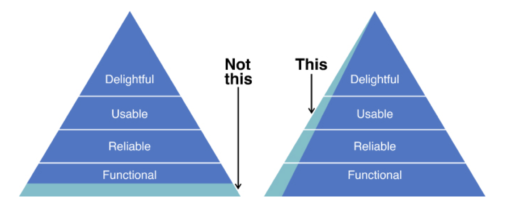
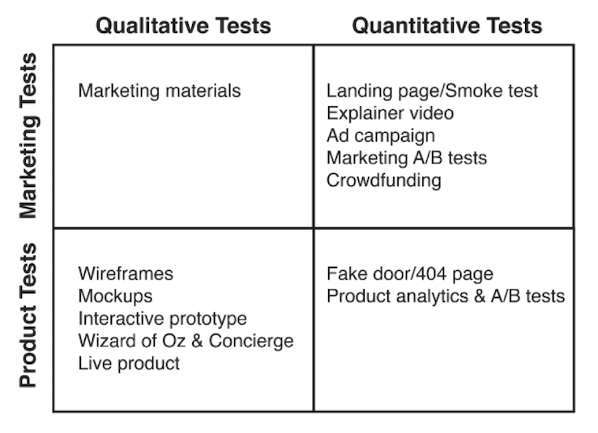

After spending considerable time in the *problem space*, Product Managers should have a pretty good list of customer needs at this point. The next step is to decide which ones to address.

The key is to focus on a set of customer needs and solve them very well.  Since uncertainty is still very high, it is not practical to spend too many resources testing the initial hypothesis. Also, the larger the scope, the less valuable the product.

Next, Product Managers need to define the feature set of the *Minimal Viable Product* (MVP). To do so, you can run as many MVP tests as needed. They will reveal if you need to change, add or remove your initial hypotheses and assumptions.

The goal is to learn if you are heading in the right direction in the cheapest way possible. This is especially important for startups.

{::options parse_block_html="true" /}

### On this section
- [Assumptions](#assumptions)
- [Hypotheses](#hypotheses)
- [Minimum Success Criteria (MSC)](#minimum-success-criteria-msc)
- [The Value Proposition](#the-value-proposition)
- [The Minimum Viable Product (MVP)](#the-minimum-viable-product-mvp)
- [The Matrix of MVP Tests](#the-matrix-of-mvp-tests)
	- [Qualitative Marketing MVP Tests](#qualitative-marketing-mvp-tests)
	- [Quantitative Marketing MVP Tests](#quantitative-marketing-mvp-tests)
	- [Qualitative Product MVP Tests](#qualitative-product-tests)
	- [Quantitative Product MVP Tests](#quantitative-product-tests)

## Assumptions

An *assumption* is a belief with no evidence to support it. It’s something we take for granted when thinking about the problem.

As a Product Manager you want to make a list of all your assumptions and choose the riskiest. The ones that, if not true, will make your product fail. If that's the case, you can go back to the drawing board and pivot.

Some examples of common assumptions are:
- *"My customer have problem x,y,z"*.
- *"My customer care about x"*.
- *"My customer would pay for solution x"*.
- *"There are no satisfactory substitutes so far"*.

The riskiest assumptions usually live on the problem space. If your customers don't have the problem you're trying to solve, they won't care about your product. Then, convert these assumptions to hypotheses.

## Hypotheses

A *hypothesis* is a specific statement, testable with an experiment, of what you believe is true. It has a target customer group, an expected outcome and a strategy to get customers to behave in a specific way. Hypotheses bring clarity to everyone on the team.

When building new products, this basic template for writing hypotheses works great:

> **We believe** [subject/target]  **will** [predicted action] **because** [reason]

In established companies with existing products, there is a more specific way of thinking about them:

> **We believe** [subject/target] **has a** [problem] **because** [reason]. **If we do** [action], **this** [metric] **will improve** 

The main difference between assumptions and hypotheses is that hypotheses are actionable. They turn one or more assumptions into a falsifiable hypothesis.

## Minimum Success Criteria (MSC)

A *Minimum Success Criteria* (MSC) is how you make a hypothesis falsifiable. This criteria helps you decide whether your product is worth building after all.

It is common that most of the experiments end up somewhere in the middle of *valid* and *invalid*. This means that if you don't define this criteria beforehand, it would be hard to make a decision objectively.

As a Product Manager, you should also include the *Return of Investment* (ROI) of the experiment in your MSC. The ability to compare the cost/reward ratio among experiments is more important than the actual value. An MCS provides clarity and meaning to your team.

## The Value Proposition

The *value proposition* gathers the customer needs that your product is going to address. By doing this, you're also deciding what not to address. This is key to define the product vision and strategy.

The most important thing is to clearly articulate how your product is different and better from the current alternatives.

Once the value proposition is ready, it is your job as a Product Manager to define the feature set that delivers on your value proposition.

##  The Minimum Viable Product (MVP)

Now, it is time to move from the problem space to the *solution space*. However, building a product to deliver on the full value proposition is too risky. As a Product Manager, you need to identify what to include in your MVP to validate that you are on the right track.

> A Minimum Viable Product is that version of a new product which allows a team to collect a maximum amount of validated learning about customers with the least effort - Eric Ries

The process starts with the whole team brainstorming and generating as many ideas as possible. The focus should be on quantity over quality. Practice *divergent thinking* when doing this.

Then, find ways to reduce the scope of these feature ideas and prioritize them based on their value and effort.

Finally, choose the feature set that should be part of your MVP candidate. It should always tie back to your value proposition.

[From Dan Olsen's book. Resources section.](#resources)

> While an MVP has limited functionality, it should be complete by addressing those three higher-level attributes - Dan Olsen

As a Product Manager, keep in mind that an MVP has to create value for the target customer. This means that a limited feature set should not be an excuse for a mediocre product.

## The Matrix of MVP Tests

There are four types of tests you can run. Since you need validated learning from real customers, they need to think the product is *ready*.

The tolerance of your customers determines which type of MVP test is the best fit.

> Fake it till you make it

[From Dan Olsen's book. Resources section.](#resources)

### Qualitative Marketing MVP Tests

These tests mainly involve to share your marketing material to your customers and get their feedback. Anything from emails, landing pages, videos, banners, etc., will do it.

The goal is to test your value proposition. Your customers will help you understand which product benefits are more important to them.

### Quantitative Marketing MVP Tests

These tests help you validate demand for your product. The data you get as a result should help you find interviewees later on the process.

* **Landing Page/Smoke Test:** This is one of the most popular tests. The idea is to create a website that clearly describes the value proposition of your product and ask them to express some level of interest. A good practice is to ask them some kind of contact information such as their email address. You should measure the percentage of visitors who performed an action of interest (conversions).

* **Explainer Video:** This is a variation of the landing page, but with a video. This technique is particularly useful when the product is hard to explain. You should also measure conversions here.

* **Ad Campaign:** This is a great way to drive traffic to your landing page. Google Adsense or Facebook have great tools to experiment which phrases or keywords work best with your target customer. They are especially useful for optimizing customer acquisition.

* **Marketing A/B Testing:** By testing two alternative designs simultaneosly and comparing how they perform on a specific metric, you get the best performer. Any type of marketing material can be tested. Keep in mind that statistical significance is higher when the difference in performance is large or when the sample size is large.

* **Crowdfunding:** These are platforms that allow people to sell and promote products before they exist. Customers can pre-order the product before launch date. Because there is not product for customers to try yet, the offering and benefits should be crystal clear.

### Qualitative Product MVP Tests

These tests help ensure that customers see value in your actual product. They are the best way to assess and improve your *Product/Market Fit*. 

A great example is to test the product design with your customers before actually build it. This saves a lot of time and effort when making changes.

- **Wireframes:** They are a low-to-medium fidelity representation of the product. They give a good sense of relative size and position between components. Modern tools allow them to be clickeable to reflect a specific user flow or scenario. The copy is often real.

- **Mockups:** They look and feel like the final product. The fidelity can be as high as pixel-perfect. They can be also clickeable and screen a user flow that a customer can experience. They provide a very valuable feedback.

- **Interactive Prototype:** They provide a level of interaction that goes beyond clickeable screens. Web prototypes are usually built with HTML, CSS and Javascript. It is common for customers to confuse a prototype with a final product. That means setting the expectations beforehand is very important.

- **Wizard of Oz and Concierge MVPs:** These allow to test the product or service live but using manual workarounds. The idea is to work with a small group of customers, understand their needs and adapt the product. This way of validating hypothesis mitigates the risk and potential waste of building an automated process.

- **Live Product:** Once the product is ready, you should go and test it with customers. Since the final product is highest level of fidelity you may learn new things about customers.

### Quantitative Product MVP Tests

These tests work best when your product has a meaningful usage. Since the sample size is larger, you can learn how your customers behave when using your product.

- **Fake Door/404 Page:** These provide a great way to test customer demand for a feature. By including a link or button to the new feature you can measure the percentage of customers that click on it. One approach is to build a *thank you page* with a message explaining that the feature is not built yet. Another is to just leave the link broken and measure clicks. You should use them wisely.

- **Product Analytics and A/B Testing:** Product analytics provide insights about your product's usage and the baseline for A/B testing. These experiments help you compare the performance of two alternative user experiences based on a key metric. Many companies do these experiments constantly. This is how companies create great products that separates them from the rest.

---

This is a first draft and a just a glance of what Experiments look like. Take the time to learn from the resources below. We keep them up to date!

Do you have any feedback? Please, let us know [here](https://forms.gle/8VSU94ehuD1EBGG46).

## Resources

||["An Intro to the Minimum Viable Product (MVP)" by X](https://www.productmanagerhq.com/2014/09/an-intro-to-the-minimum-viable-product-mvp/)|2 min read|
||["Why and How You Should Build a Minimum Viable Product (MVP)" by](https://medium.com/tokopedia-product-team/minimum-viable-product-mvp-101-5192bc5c2a2)|2 min read|
||["What is your Riskiest Assumption? (Workshop)" by Neda D Stevanović](https://mvpworkshop.co/validate-riskiest-assumption/)|14 min read|
||["The Product Manager’s Scientific Method" by Andre Theus](https://www.productplan.com/product-manager-scientific-method/)|6 min read|
||["The Lean Startup: How Today's Entrepreneurs Use Continuous Innovation to Create Radically Successful Businesses" by Eric Ries, Chapters 6-7](https://www.amazon.com/Lean-Startup-Entrepreneurs-Continuous-Innovation-ebook/dp/B004J4XGN6/)
||["The Lean Product Playbook" by Dan Olsen, Chapters 5-7](https://www.amazon.com/Lean-Product-Playbook-Innovate-Products/dp/1118960874/)|
