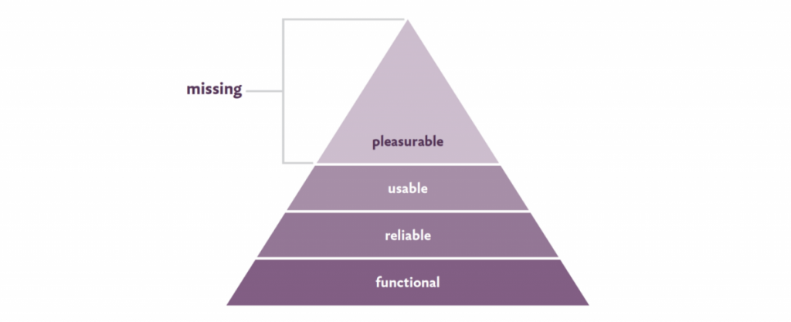
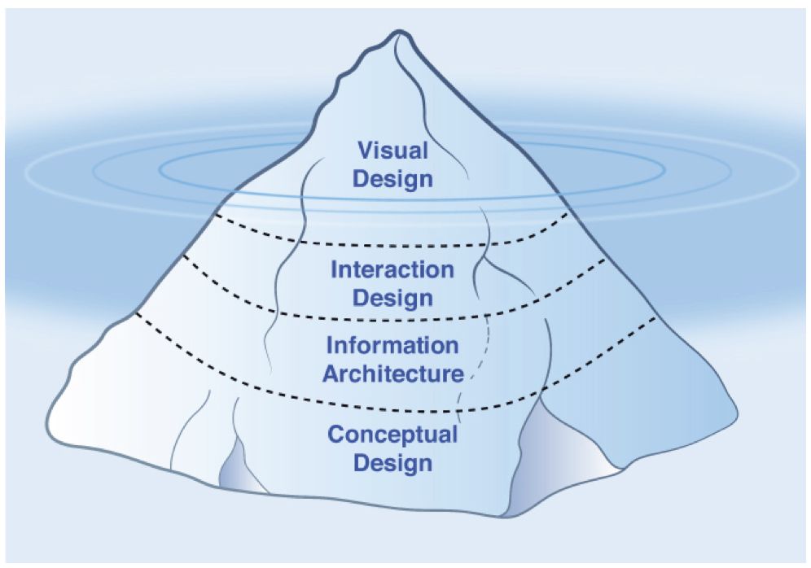

The last key aspect before moving to product development is *User Experience* (UX). It helps MVP tests to be successful since a product can't get Product-Market Fit without a great UX. It is often a powerful product differentiator.

As users, we all have experienced products with poor UX. They feel unintuitive and hard to use. They may have dead ends and cryptic messages. In contrast, products with great UX makes easy to understand what to do next. They make customers feel they are great at their job.

The feature set at this point is clear.  Product Managers need to work side by side with designers to make a product that is easy to use and enjoyable.

The goal is to deliver a product that is both usable and delightful.

{::options parse_block_html="true" /}

### On this section
- [A Great User Experience (UX)](#a-great-user-experience-ux)
	- [Usability](#usability)
	- [Delight](#delight)
- [The Minimum Viable Product (MVP) and UX](#minimum-viable-product-mvp-and-ux)
- [The UX Design Iceberg](#the-ux-design-iceberg)
	- [Conceptual Design](#conceptual-design)
	- [Information Architecture](#information-architecture)
	- [Interaction Design](#interaction-design)
	- [Visual Design](#visual-design)
- [Don't Forget About Copy](#dont-forget-about-copy)

## A great User Experience (UX)

UX defines why a product exists in the first place. It fulfills a need or solves a problem people have in a meaningful way. The solution describes how to solve the uncovered problem. This problem-solution-fit defines the core UX of the product. The feature set extends and supports this core UX but it cannot replace it.

UX design aims to create a product that is easy to use and valuable. But the product must address the functionality and benefits that customers value. UX should make these benefits obvious.

> Building features is easy, building the right features for the right people is challenging. - Nikkel Blaase

As humans, we all have basic needs to meet. Maslow’s approach to identifying human needs can help us understand our goals when designing products.

[From Aarron Walter's book. Resources section.](#resources)

As a Product Manager, your job is to create a product that is functional, reliable and usable. That's the base of the pyramid. If the product can also put a smile on your customer's face then you have a delightful product as well.

The two fundamental components of great UX are usability and delight. They are the best way to evaluate your product's UX.

### Usability

*Usability* focuses on customer's goals and the tasks required to achieve them. It helps to avoid frustration by showing a poor UX.

Here are some of the aspects that usability addresses:
- **Level of effort**: The effort required to take action impacts the percentage of customers who take that action. Customers should learn to perform basic tasks fast, without a lot of relearning.
- **Efficiency**: Customers may be able to figure out how to use a feature but it requires too many steps or takes too long.
- **Available information**: Too much information or too many choices may overwhelm customers. A great user onboarding helps to turn new customers into active customers.

As Product Manager, you should measure the time and effort customers need to use your product. How long it takes to go from having no knowledge of your product to working knowledge. How long it takes to go from working knowledge to mastery. Improving any of these impacts on usability.

### Delight

*Delight* focuses on evoking positive emotions. It goes beyond avoiding frustration. Customers will only recommend a product that is enjoyable to use.

Some of the aspects of a delightful product:
- **Aesthetics**: A pleasant design conveys a sense of quality and makes the product seem more credible. Ensuring that the product looks appealing helps customers feel at ease.
- **Simplicity**: Removing cognitive load helps customers focus on what's important. Less is often more in UX design.
- **Default options**: By selecting smart default choices the product makes customers feel understood. Empathy creates delight.
- **Surprise**: Your product can amuse customers by doing unexpected things. The unexpected sticks in mind.

Customers expect that a product reflects a personality they can relate to. A connection with the people behind that product. Emotional experiences make a profound impact on our memory. They will forgive shortcomings if they get positive emotions in return. That's how you build engagement.

As a Product Manager, you should create delight on every iteration. Do it enough and it will make your product stand out as remarkable.

## The Minimum Viable Product (MVP) and UX

The goal of the MVP tests is to learn if you are heading in the right direction in the cheapest way possible. UX design helps this process to deliver a complete product with limited functionality. Not paying attention to UX during MVP tests results in a mediocre product.

The principles of this holistic approach:
1. Remove waste from the UX design process.
2. Build a common ground for everyone involved in the product.
3. Ensure a mindset shift to an experimentation model.

The two pillars behind this approach are *Design Thinking* and *Agile Development*. Design thinking takes an iterative, problem-focused approach working towards perfection. Agile development refocuses software development on value. Outcome over output.

These pillars break the bottleneck between development and design in the product-development lifecycle. Designers are no longer isolated from business needs anymore. They are completely involved during the initial phase of validation.

As Product Managers, you need to help your team understand that they are not going to get it right the first time. Sometimes designers have the feeling that they're showing work that is not ready. This can be challenging to overcome. Make sure every new iteration is in the right direction to reduce that feeling.

## The UX Design Iceberg

*The UX Design Iceberg* is a framework created by Dan Olsen. The analogy of an iceberg helps understand that only a part of UX design is visible to customers. Yet, there are other critical components to define before getting to the surface.

[From Dan Olsen's book. Resources section.](#resources)

The lowest layer of the iceberg is **Conceptual Design**, the core of the UX and the reason the product exists. Then, **Information Architecture** defines how to organize the product's functionality and information. Next, **Interaction Design** determines how the customer and the product interact with each other. Finally, **Visual Design** represents how the product looks and customers see.

Creating an outstanding UX design requires a great job at all four layers of the iceberg.

### Conceptual Design

*Conceptual Design* is what brings your product to life and the core of the user experience. It represents how well you understand your target customer needs. This is often one of the main contributors to product innovation.

A product with a good conceptual design feels intuitive and natural to use. It resonates with the way your customers think and behave. Another reason why a deep understanding of the *problem space* is so important.

*User Research* techniques help to understand your customers' goals. *User Personas* are better to understand the context in which customers use the product.

After you find a conceptual design your customers may find valuable, it's time to organize the product.

### Information Architecture

*Information Architecture* defines how to organize the functionality and information of your product. When customers look for something they rely on navigation labels. This discipline deals with the feature set of your product at a high-level. Customers don't know your product well at first so it's important to make this job easy.

A good information architecture organizes the product in a way customers find intuitive. Labels are easy to understand, functionality is obvious, and information is clear. They all contribute to good usability and findability.

One important artifact of information architecture is the *Sitemap*. Sitemaps define a product's structure and are a great way to keep everyone on the team in sync. A sitemap includes all pages or screens, its hierarchy, and the high-level navigation.

Once the sitemap is ready, the next step is to identify how the user experience flows across the product.

### Interaction Design

*Interaction Design* defines the relationship between the customer and the product. How they interact with each other on every possible user flow. This can be anything from possible actions to information required, to how the product responds.

Some elements that interaction design includes:
- **Information required**: What information asked or requested from the user is valid.
- **Operation modes**: Some screens may have alternative modes such as *edit* or *preview*.
- **Product states**: Some products have different states that limit what the customer can or can't do.
- **Product feedback**: How the product responds may affect the way customers perceive the product. Error messages or response time are examples of this.

A good interaction design would cover all these aspects on every step of the user flow. It should manage customers' expectations through the product's feedback and guidance.

The primary artifact of interaction design is the *Flowchart*. Flowcharts represent possible flows in your user experience at a high level. They help everyone on the team understand the UX the product should deliver. It is a common thing to skip this step when the user flow is simple.

The second artifact is *Wireframes*. Wireframes are more visual and interactive which makes them more effective to communicate a design. They also address the design details of every screen or page. 

For the first time, you now have a *solution space* artifact ready. As a Product Manager, your job is to test it with real customers. Only then, you can move to the final layer, visual design.

### Visual Design

*Visual Design* is what your customers see. The look-and-feel of your product at this point is built on top of all previous layers. A solid visual design helps your product to differentiate from others.

A good visual design creates an enjoyable product that shows your brand's personality. On top of aesthetics, it helps to reinforce visual hierarchy and usability.

The three major components of visual design are:
- **Color**: Contributes to the aesthetics and helps certain elements of the screen to stand out. Color has a direct impact on readability, which also affects usability. It is common to have one or two primary and secondary colors. Avoid using too many colors and be mindful of how customers perceive color.
- **Typography**: Contributes to visual hierarchy. The arrangement and appearance of text reinforce the tone you want to set with your product. Avoid using too many text sizes.
- **Images and illustrations**: Their importance depends on the type of product. In some products, images can make a huge difference in conversion rates. They are often used on marketing content. In contrast, illustrations are good to explain how a product works.

Make sure your product's visual design is consistent to deliver a great UX.

The most important artifact in visual design is the high-fidelity *Mockup*. Mockups capture the visual design by using color, typography, and graphics. They can also be interactive, which makes easy to confuse them with a final product. As a Product Manager, keep this in mind when showing them to customers.

Once your customers find these mockups valuable and usable, it's time to go build the product.

## Don't Forget About Copy

*Copy* is the text your product uses to communicate. This can be elements such as labels, descriptions, instructions, and messages. They should be simple enough so your customers don't have to guess.

Most product people know that copy in marketing's content is critical because of the impact on conversion rates. What is not common knowledge is how the quality of the copy in your product has a similar impact on usability. Every text in your product should be clear, concise, and avoid any type of jargon.

The best tool Product Managers have to validate the product's copy is *Usability Test*.

---

This is a first draft of what User Experience is about. Take the time to learn from the resources below. We keep them up to date!

Do you have any feedback? Please, let us know [here](https://forms.gle/8VSU94ehuD1EBGG46).

## Resources

||["The Lean Product Playbook" by Dan Olsen, Chapter 8](https://www.amazon.com/Lean-Product-Playbook-Innovate-Products/dp/1118960874/)|

||["Designing for Emotion" by Aarron Walter, Chapter 1](https://www.amazon.com/Designing-Emotion-Aaron-Walter/dp/1937557006/)|

||["Lean UX: Applying Lean Principles to Improve User Experience" by Jeff Gothelf, Part I](https://www.amazon.com/Lean-UX-Designing-Great-Products-ebook/dp/B01LYGQ6CH/)|

||["Why Product Thinking is the next big thing in UX Design" by Nikkel Blaase](https://medium.com/@jaf_designer/why-product-thinking-is-the-next-big-thing-in-ux-design-ee7de959f3fe)|5 min read|