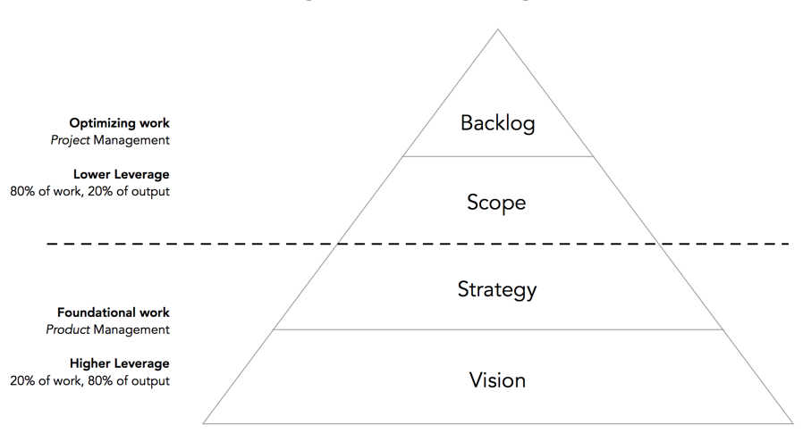

One characteristic of great Product Managers is that they provide direction. They drive execution based on the product's vision and strategy.

Every company is different. They have different priorities, values, strengths, and weaknesses. By understanding these, it is easy to decide which product opportunities to pursue.

The product strategy describes how the team is going to achieve that vision. They keep the team aligned and support every product decision.

Product Managers product decisions like these every day. That is why is  so important to learn where they apply the most leverage.

{::options parse_block_html="true" /}

### On this section
- [Product Vision](#product-vision)
- [Product Strategy](#product-strategy)
- [Product Roadmap](#product-roadmap)
- [Leverage as Product Managers](#leverage-as-product-managers)

## Product Vision

The product vision provides direction and inspiration for the team.  It describes the end state of the product and pushes the team to think big.

Sometimes, the Product Manger is in charge to come up with a compelling product vision. Sometimes the product vision comes from the leadership team. In any case, both need to meet regularly and spend time talking about it.

The benefits of a compelling product vision are:
- Stakeholders awareness.
- Common enthusiasm and understanding from everyone involved.
- Team alignment on product decisions during execution.

The product vision has to fit into the bounds of the company’s vision. Product Managers are responsible of communicating and evangelize the product's vision.

## Product Strategy

The product strategy describes how to achieve the product vision. It answers what you aim to accomplish and why, who is the target customer and why, and how you will get there and why. 

Many companies think about product Strategy as a roadmap. However, a roadmap should be an output of a strategy.

A product strategy also has to fit into the bounds of the business strategy. The business strategy provides a budget and a set of key metrics. The product team lives within that budget to come up with the best way to hit those metrics.

By defining the product's vision and strategy, a Product Manager and her team can move to execution towards a known destination.

## Product Roadmaps

A product roadmap is a list of initiatives supported by the product vision and strategy.

There is only a limited amount of improvement you can add to a product. That's why is so important that roadmaps include only what makes sense for the product to succeed.

Product roadmaps represent hard decisions. They are all about trade-offs. If you focus only on new features, you end up with a Frankenstein product. But if you focus only on bug fixing, you product becomes irrelevant.

A good practice is to use Anthony Ullwick's opportunity algorithm. It provides a practical way to rank product initiatives based on importance and satisfaction.

> **Importance + (Importance – Satisfaction)**

## Product Managers Leverage

Although Product Managers don't manage people, they apply what Andrew Grove calls *Managerial Leverage*. This is the idea that not every task a manager does, creates the same amount of output. Some tasks create more output than others and that's where the leverage is.

A Product Manager makes many decisions everyday, so it's critical to know which ones have the most impact.

Moreover, some decisions may decrease your team's leverage.  They are the ones who know how to build things so focusing on implementation details makes no sense.

> Product managers exert the most leverage through vision and strategy, the rest is optimization - Brandon Chu

[From Brandon Chu's article. Resources section.](#resources)

**Vision and Strategy:** They provide direction and inspiration to the team. They are the groundwork for execution.

**Scope and Backlog:** They accelerate progress towards the vision. They optimize execution.

Product Managers should focus on the most impactful work first. That is the product's vision and strategy. Only after, your team have the right foundations to operate.

---

This is a first draft and a just a glance of the importance of vision and strategy in Product Management. Take the time to learn from the resources below. We keep them up to date!

Do you have any feedback? Please, let us know [here](https://forms.gle/8VSU94ehuD1EBGG46).

## Resources

||["Business Strategy vs. Product Strategy" by Marty Cagan](https://svpg.com/business-strategy-vs-product-strategy/)|4 min read|
||["What is Good Product Strategy?" by Melissa Perri](https://medium.com/@melissaperri/what-is-good-product-strategy-8d5587cb7429)|7 min read|
||["What is a great Product Strategy, really?" by Espen Sundve](https://uxdesign.cc/what-is-a-great-product-strategy-really-d22b14d54e8)|5 min read|
||["Applying Leverage as a Product Manager" by Brandon Chu](https://blackboxofpm.com/applying-leverage-as-a-product-manager-ffad4a99db24)|5 min read|
||["High Output Management" by Andrew S. Grove, Chapter 3](https://www.amazon.com/High-Output-Management-Andrew-Grove-ebook/dp/B015VACHOK/)|
||["Intercom on Product Management" by Intercom, Chapter 2](https://www.intercom.com/books/product-management)|